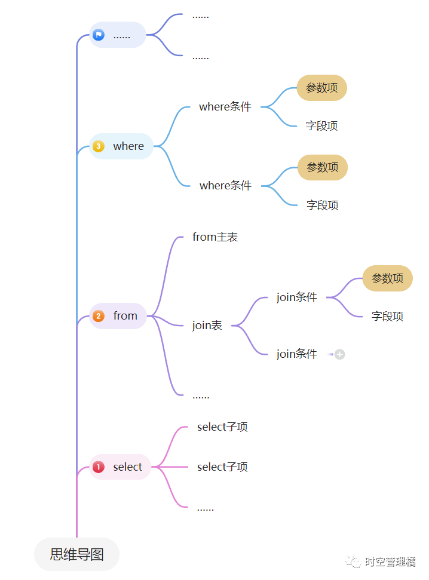
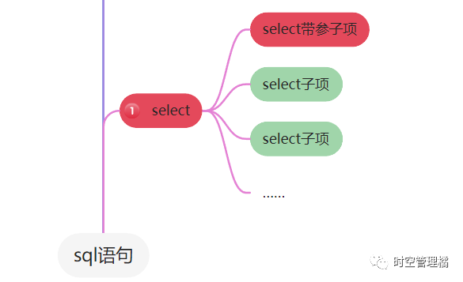

# rivulet(溪流)
## 目录
+ [说明文档](#说明文档)
+ [快速开始](#快速开始)
+ [亮点与特性](#亮点与特性)
  + [持久层统一思想](#持久层统一思想)
  + [对象化SQL](#对象化SQL)
  + [语句拼接](#语句拼接)
  + [扩展性强](#扩展性强)
+ [基本查询演示](#基本查询演示)
+ [没有缓存](#没有缓存)
+ [设计演进](#设计演进)
+ [画饼](#画饼)
+ [半成品](#半成品)
+ [寄语](#寄语)

## 说明文档
1. [spl语句映射规则](docs/cn/使用说明/sql语句映射规则.md)
2. [扩展点](docs/cn/使用说明/扩展点.md)
#### 其他介绍文档
1. [概览介绍](https://mp.weixin.qq.com/s/h4YeXvYREXcMRS9HwqBKaw)
2. [关于轻松写出一个SQL](https://mp.weixin.qq.com/s/TW_k1Ur-L0nmCBXFJyJ4HA)

## 快速开始
### 使用spring接入
[rivulet-spring](https://github.com/uigdwunm/rivulet-spring)
### 使用原生方式接入（最简单案例快速开始）
>
>&lt;dependency>\
>&ensp;&ensp;&ensp;&ensp;&lt;groupId>io.github.uigdwunm&lt;/groupId>\
>&ensp;&ensp;&ensp;&ensp;&lt;artifactId>rivulet-mysql&lt;/artifactId>\
>&ensp;&ensp;&ensp;&ensp;&lt;version>0.0.13-PREVIEW&lt;/version>\
>&lt;/dependency>
1. 准备声明RivuletManager，并配置要扫描的包。
```java
public class CreateSQLRivuletManagerTest {
  public SQLRivuletManager createRivuletManager() {
    SQLRivuletManager rivuletManager = new DefaultMySQLDataSourceRivuletManager(
            new MySQLRivuletProperties(),
            createRealDataSource()
    );
    rivuletManager.putInStorageByBasePackage("zly.rivulet.mysql");
    return rivuletManager;
  }
}
```

2. 声明表模型对象，这里需要比较全面的表信息。
+ 类注解 @SQLTable 是必须的，对应表名
+ 每个字段的@SQLColumn 是必须的，对应字段名。
+ 每个字段的类型 比如 @MySQLBigInt、@MySQLVarchar……，也是必须的
```java
@SQLTable("t_person")
public class PersonDO {

  @PrimaryKey
  @SQLColumn("id")
  @MySQLBigInt
  private Long id;

  @SQLColumn
  @MySQLVarchar(length = 64)
  private String name;
  
  public Long getId() {
    return id;
  }

  public void setId(long id) {
    this.id = id;
  }

  public String getName() {
    return name;
  }

  public void setName(String name) {
    this.name = name;
  }
}
```

3. 在扫描的包路径范围内，声明Desc来表达sql语句。
+ Desc方法必须是无参方法，返回值WholeDesc。
+ 方法必须加注解 @RivuletDesc，并赋予一个唯一key，用来定位这个语句。
```java
public class CreateDesc {
  @RivuletDesc("queryById")
  public WholeDesc queryById() {
    return SQLQueryBuilder.query(PersonDO.class, PersonDO.class)
            .where(Condition.Equal.of(PersonDO::getId, Param.staticOf(2)))
            .build();
  }
}
```

4. 调用时，通过RivuletManager对象，获取一个Rivulet进行调用。
+ rivulet对象有各种方法，需要通过key定位语句，就是上面@RivuletDesc中的key
+ 如果查询单个就queryOne，多个就queryMany
```java
public class ExecTest {
  public void exec() {
    Rivulet rivulet = rivuletManager.getRivulet();
    PersonDO result = rivulet.queryOneByDescKey("queryById", Collections.emptyMap());
  }
}
```

## 亮点与特性
### 持久层统一思想
这是我在结构设计上预留的一种可能性。\
当我们访问mysql、oracle、pgsql、mongo、es等，这些存储类中间件时，会使用其各自的语法语句来进行调用。\
那你可曾想过，一些简单的查询行为，本质上是统一的模式。\
保存、更新之类的就不必多说了都一样，来想想常用的查询。\
比如等值查询(=)、大于(>)、小于(<)、in之类的操作。
意义上是不是统一的？\
但是我们要用每种中间件的语法去写语句。\
好烦啊！！！\
为什么没人把这些都封装起来!\
……\
无所谓，我会出手!\
话说回来，目前为止，这还只是个饼。\
我只实现了mysql的封装。\
但是在架构设计上我已经做好准备了，看看模块划分。
+ rivulet-base
+ rivulet-spl
+ rivulet-mysql

这个饼先画在这，等我有空慢慢搞。

### 对象化SQL
我们java程序员，号称是面向对象变成的。\
sql明明是个可以语义化的东西，为啥不用用面向对象的方式来表达呢？\
hibernate可能算是，但是它完全定义了一套新的规则，sql原型都没了，太重了，我不喜欢。\
mybatis只是一种sql拼接方式，跟对象完全不沾边。\
mybatisPlus只是mybatis拼语句的加强版。\
还有我最近知道的一个新的框架[JOOQ](https://github.com/jOOQ/jOOQ)，这个大概是最接近我想要中的对象化sql了，但是他的还是更像一种用java代码拼语句的逻辑。\
sql是一种有层级、有包含关系的语法，其中有着子查询、联表查询这种复杂的操作。\
对象化是啥呢？\
表可以视为对象；select部分可以视为对象；from部分可以是为对象……\
好像还是很难表达出来……\
我觉得有一个小点可能能稍微感受一下，就是当我们联表了多个表并且其中有些表重复时，那么在查询条件中，我如何通过对象化sql来表达，我要用哪个联表的表来进行条件查询。\
我觉得能把这一点做好，并且看的人也能一目了然，就算实现的比较好了。\
这方面我的解法会有些麻烦，但是我觉得还是能一目了然的。\
我的方案还有个非常大的优势。\
就是你很难写出错的sql语句，这方面我非常巧妙的利用了java语言的特性，继承、泛型之类的，实现了一种效果。\
你可以轻松通过IDE的提示写出语句，只要能通过编译那么几乎就是合法的sql。\
这一点上，我从没见有框架能做到过，并且这么优雅!\
虽然不敢大声BB，但是这可能是我首创的！\
最后说下解析。\
对象化sql的解析也是非常头痛的，你可以想象，当一个查询存在联表、子查询、嵌套子查询时，该怎么一个个摘出对应的表和字段。\
这方面，我在解析时，抽象出一层虚拟的代理层，用代理层中的对象来代替一个个表。\
说起来轻松，为了解决这个难题我不知道薅掉多少头发。\

### 语句拼接
这个单独作为一个特性有点奇怪。\
sql就短短的那么一段字符串实际上耗不了太多性能，不过我为了拼sql的极致效率还是整了点花活。\
一般sql拼接都是用占位符替换的。\
首先看看sql的语法树。
真的是一棵树。
\
我将对象化的sql利用起来，有了语句的父子包含关系，可以将每个部分进行缓存。\
其中不能缓存的地方，比如参数，就标记上，同时子级对象不能缓存，那父级对象也不能缓存，要有连带失效的能力。\
这样处理整条sql语句后。\
\
如图，红色是不能缓存的，绿色是可以缓存的。\
只要语句中每个部位都能缓存，那么最外层的父级就能直接拿到。\
虽然原理很简单，不过实现还花了点小心思，做这种小玩具挺好玩的。\

### 扩展性强
在我看来，扩展性才能决定这个框架的生命力。\
大的方面来看。\
我设计的架构，把每个过程都拆成部件，每个部件都工具化，你可以单独使用每个部件。\
从细微处看，每个语句的解析，每次执行前后、包括执行本身，都充分预留了扩展的点。\
我设想的是，可以有一个专门的线上管理后台，监控这些数据，必要时甚至可以更改线上正在运行的sql。

## 基本查询演示
### 1、查询
#### 准备表对象（必须有getter方法，这里节省篇幅省略）
```java
@SQLTable("t_province")
public class ProvinceDO {
    @PrimaryKey
    @SQLColumn("code")
    @MySQLInt
    private Integer code;

    @SQLColumn
    @MySQLVarchar(length = 16)
    @Comment("省份名称")
    private String name;
}
```
``` java
@SQLTable("t_city")
public class CityDO {
    @PrimaryKey
    @SQLColumn("code")
    @MySQLInt
    private Integer code;

    @SQLColumn
    @MySQLVarchar(length = 16)
    @Comment("城市名称")
    private String name;

    @SQLColumn("province_code")
    @MySQLInt
    @Comment("所属省份code")
    private Integer provinceCode;
}
```
#### 查询演示
```java
public class QueryTest {
  /**
   * 预编写查询逻辑
   **/
  @RivuletDesc("queryProvince")
  public WholeDesc queryProvince() {
    // 从参数中动态取值
    Param<Integer> provinceCodeParam = Param.of(Integer.class, "provinceCode", ParamCheckType.NATURE);
    // 查询语句
    return QueryBuilder.query(ProvinceDO.class, ProvinceDO.class)
            .where(Condition.equalTo(CheckCondition.notNull(provinceCodeParam), ProvinceDO::getCode, provinceCodeParam))
            .build();
  }

  /**
   * 执行查询
   **/
  public void query() {
    Rivulet rivulet = createDefaultRivuletManager().getRivulet();
    HashMap<String, Object> paramMap = new HashMap<>();
    // 参数
    paramMap.put("provinceCode", 123);
    // 查询，通过预编写的查询语句方法上的注解@RivuletDesc的key找到语句。
    ProvinceDO provinceDO = rivulet.queryOneByDescKey("queryProvince", paramMap);
  }
  /**
   * 预先生成管理器
   **/
  public RivuletManager createDefaultRivuletManager() {
    DefaultWarehouseManager defaultWarehouseManager = new DefaultWarehouseManager("zly.rivulet.mysql");
    return new DefaultMySQLDataSourceRivuletManager(
      new MySQLRivuletProperties(),
      new ConvertorManager(),
      defaultWarehouseManager,
      createDataSource()
      );
  }
}
```

#### 查询映射原DO模型语句
```java
public class Desc {
    @RivuletDesc("queryProvince")
    public WholeDesc queryProvince() {
        // 从参数中动态取值
        Param<Integer> provinceCodeParam = Param.of(Integer.class, "provinceCode", ParamCheckType.NATURE);
        // 查询
        return QueryBuilder.query(ProvinceDO.class, ProvinceDO.class)
            .where(Condition.equalTo(CheckCondition.notNull(provinceCodeParam), ProvinceDO::getCode, provinceCodeParam))
            .build();
    }
}
```
+ 通过QueryBuilder开始编写sql语句
  + query的第一个对象是From的表对象，第二个对象是查询结果映射
  + 这里查询对象是ProvinceDO，映射对象也是ProvinceDO，可以设置成不同的，但是要手动映射select

#### 联表查询
准备一个联表模型，用于描述表之间的连接关系
```java
/**
 * 联表对象需要继承QueryComplexModel
 **/
public class CityProvinceJoin implements QueryComplexModel {

    private CityDO cityDO;

    private ProvinceDO provinceDO;

    @Override
    public ComplexDescriber register() {
        ComplexDescriber describer = ComplexDescriber.from(cityDO);

        // 联表条件
        describer.leftJoin(provinceDO).on(JoinCondition.equalTo(provinceDO::getCode, cityDO::getProvinceCode));

        return describer;
    }
}
```
联表查询语句
```java
public class Desc {
    @RivuletDesc("queryCityProvinceJoin")
    public WholeDesc queryCityProvinceJoin() {
        // 从参数中动态取值
        Param<Integer> cityCodeParam = Param.of(Integer.class, "cityCode", ParamCheckType.NATURE);
        // query的from对象就是上面的联表模型
        return QueryBuilder.query(CityProvinceJoin.class, CityProvinceJoin.class)
            .where(
                Condition.equalTo(x -> x.getCityDO().getCode(), cityCodeParam)
            ).build();
    }
}
```
#### 映射不同的查询结果对象
```java
public class Desc {
    @RivuletDesc("queryCityProvinceJoin2")
    public WholeDesc queryCityProvinceJoin2() {
        // 从参数中动态取值
        Param<Integer> cityCodeParam = Param.of(Integer.class, "cityCode", ParamCheckType.NATURE);
        // 使用不同的对象映射结果
        return QueryBuilder.query(CityProvinceJoin.class, CityInfo.class)
            .select(
                Mapping.of(CityInfo::setCityCode, x -> x.getCityDO().getCode()),
                Mapping.of(CityInfo::setCityName, x -> x.getCityDO().getName()),
                Mapping.of(CityInfo::setProvinceCode, x -> x.getProvinceDO().getCode()),
                Mapping.of(CityInfo::setProvinceName, x -> x.getProvinceDO().getName())
            )
            .where(Condition.equalTo(x -> x.getCityDO().getCode(), cityCodeParam))
            .build();
    }
}
```

## 没有缓存
+ mybatis是有缓存的，但是我这里没有。
+ 在单机的时代，缓存是会有非常大的优势，但是现在都是集群，感觉缓存已经有点鸡肋了。
+ 目前没考虑，但是我留下了足够的扩展点，相加也能加。

## 设计演进
+ 第一阶段
  + 一开始我只是在开发过程中使用了mybatis，觉得每次写语句都比较麻烦，还总是写错。
  + 觉得hibernate那种映射很方便，但是联表查询又很麻烦。
  + 于是想要自己设计一种方式把他们结合起来。
+ 第二阶段
  + 当我在设计我设想中的框架时，第一点想到的，也是最重要的定位就是方便拼语句。
  + 性能方面，语句必须预先编译好，易于拼接参数，拼好语句后，其余的由连接池操心。
  + mybatis-plus
    + 当我开始设计调研时，在github上随便查了一下，看到了mybatis-plus
    + 其实它有一部分可以满足我的需要了,但是我逐步发现mybatis-plus还是支持的不够，拼语句的能力局限较大。
    + 并且mybatis-plus只是mybatis的一个插件，有一定的局限性。
    + 当然，说了这么多，主要还是觉得我的设计更好。
+ 第三阶段
  + 当我把拼语句作为框架的主要定位时，有一天我突然想到，查sql是拼语句，查mongo也是拼语句，查es也是拼语句。
  + 那完全可以把他们统一起来，所以变成了现在的模块分包。
+ 第四阶段
  + sql、mongo、es这些存储类的中间件，有一些通用的查询能力，比如：
    + equal字段
    + in字段
    + \>
    + <
    + like
    + ……
  + 这种简单的单表查询，以及单表的增删改，是绝大部分的使用场景。
  + 那么完全可以在base层用统一的格式来屏蔽掉这种检查查询的底层语句。
    + 对使用者来说可以用同一种格式，查询sql、mongo、es。
  + 实际上随着现在微服务的流行，表越拆越细、简单的单表查询已经成为常态。

## 画饼
+ 最大的饼，就是有一天能统一持久层，用同一种语法调用所有的存储中间件。
+ 运行时
  + 如果你们公司有个类似db管理的平台。
  + 我通过扩展接口留了很多口子，理论上可以在运行过程中调整这些。
  + 所有的语句都是以definition为基础的，通过预定义的key映射
    + 理论上可以在程序运行时修改definition，重新映射到key，也就是修改语句。
    + 当然映射结果不能变。
    + 参数也是固定的没法变。
+ 编译时
  + 定义器中收集了表的ddl元数据，
    + 理论上可以在编译阶段，就对语句进行分析，判断有没有走索引，或者其他什么。
  + 我把sql语句解构的非常细，每个元素都能独立获取，所以解析语句很容易。

## 半成品
+ 这个框架经过几番改进、推倒重头再来，又因为我的拖延症，历经了一年多快两年，终于成为一个半成品。
+ mysql
  + 我是以mysql的语法支持来实现第一个版本的
  + 后来发现想要相对完整的支持sql，真的太难了。
    + sql的联表查询、子查询嵌套、别名、各种类型，还有函数都太变态了。
  + 好在现在已经解决了这些，目前的半成品已经初步可以展示出我的框架的强大之处。
+ 目前还是个半成品，不过暂时没时间完善了，先放出来给大家看看，帮忙支持下点点star，希望为我下次跳槽加点分。
+ 坦白来说，饼画的太大，我一个人有点搞不定了。
  + 虽然各个组件已经跑通了基本逻辑，但是很多细节没填充，操作符、函数之类的只实现了一两个。
  + 包括很多少见的类型，或者我一时没想起来的东西还没支持。
+ 我自己写了几个测试方法，勉强能运行，肯定还都是bug，先看着，我慢慢改。

## 寄语
+ 希望以后有公司接盘，让我全职维护最好了🤣
+ 不做梦了，先活下来再说。
+ 我闷头开发了快两年，写代码越来越提不起劲，也是因为没有反馈。
+ 虽然我一直觉得东西很不错，但都是自嗨，没人真正看到 
+ 有些细节我觉得我设计的非常nb，希望有一天有人能发现。
+ 现在还是个半成品放出来，也是因为自嗨太久没动力了。
+ 点个star是对我的鼓励，希望大家支持一下。
